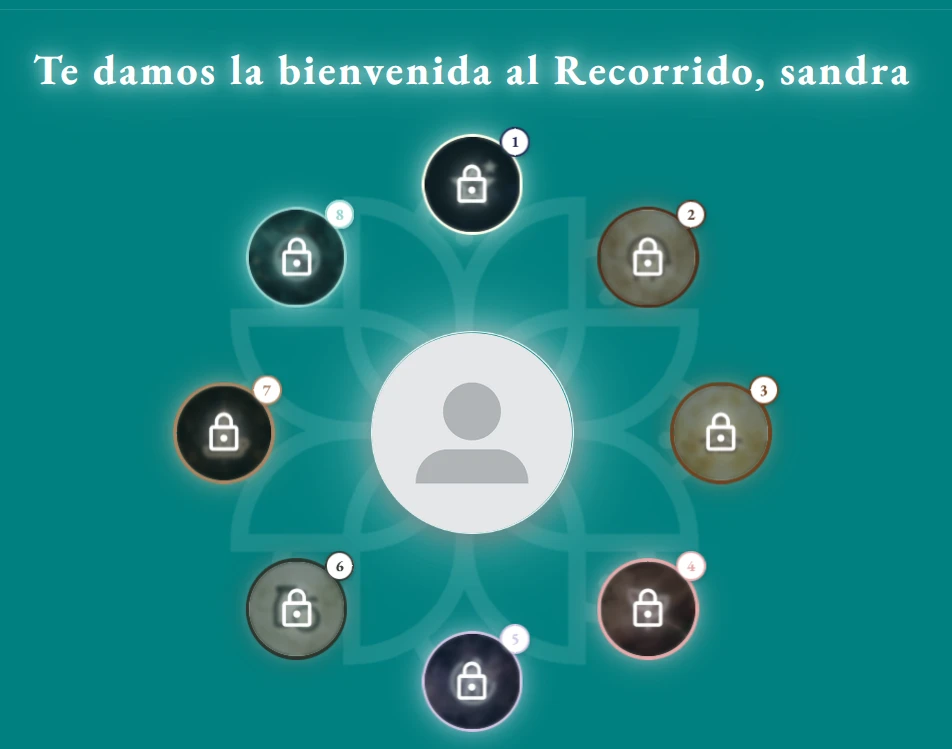

# 1. Introducción

El mercado del bienestar digital mueve hoy más dinero que nunca. Las aplicaciones de salud mental, meditación, hábitos y autoconocimiento se cuentan por decenas de miles en las tiendas de aplicaciones, y algunas de ellas —Calm, Headspace, Co–Star— han alcanzado valoraciones de cientos de millones de euros. Al mismo tiempo, y a pesar de esa abundancia, las encuestas sobre bienestar subjetivo no mejoran. Hay más contenido disponible que nunca y, sin embargo, la sensación generalizada es la de estar consumiendo fragmentos sueltos que no llegan a formar nada.

La razón es, en buena medida, estructural. El contenido sobre autoconocimiento se distribuye hoy por tres canales, y los tres empujan hacia la fragmentación:

- **Las redes sociales.** El formato dominante —un vídeo corto, una imagen con texto— premia la frase que se recuerda, no el razonamiento que la sostiene. Una persona puede pasar meses viendo contenido sobre apego, doshas o índice glucémico sin llegar nunca a entender de dónde salen esos conceptos ni cómo se relacionan entre sí.
- **Las aplicaciones comerciales de bienestar.** Funcionan por sesiones sueltas: una meditación de diez minutos, un horóscopo diario, un ejercicio de respiración. Están diseñadas para la visita recurrente y breve, no para el recorrido largo. Y en el caso concreto de las aplicaciones de astrología, la mayoría entrega textos generados automáticamente sin explicar en ningún momento qué es una casa astrológica, qué es un aspecto o por qué el resultado dice lo que dice.
- **La formación reglada y los manuales.** Son rigurosos, pero están pensados para quien va a dedicarse profesionalmente a la materia. Su puerta de entrada es demasiado alta para quien simplemente quiere entenderse mejor.

Entre el vídeo de treinta segundos y el manual de seiscientas páginas hay un hueco enorme, y ese hueco es el que ocupa este Trabajo de Fin de Grado.

## 1.1. Qué es Life as a Privilege

*Life as a Privilege* es una plataforma web de autoconocimiento guiado. Su unidad básica no es la lección ni la sesión: es **el Recorrido**, una secuencia larga de pasos encadenados dentro de una disciplina, en la que el usuario avanza leyendo, respondiendo y poniéndose a prueba, y de la que sale con un documento propio.

La plataforma contiene ocho disciplinas, que el usuario puede abrir en el orden que quiera:

1. **Astrología** — la carta natal propia, calculada a partir de la fecha, hora y lugar de nacimiento, y explicada planeta a planeta, casa a casa y aspecto a aspecto.
2. **Psicología** — la línea de vida, el genograma familiar, los cuestionarios ACE y DES-II, y el mapa personal de huellas, nudos y heridas.
3. **Ayurveda** — el test de constitución (*doṣha*), el recorrido del doṣha resultante y los siete chakras.
4. **Medicina Tradicional China** — los cinco elementos, el test de constitución, los ciclos, la lectura de la lengua, el taoísmo y el qigong.
5. **Fisiología** — el viaje desde la partícula hasta el organismo, pasando por átomos, moléculas, células y sistemas.
6. **Nutrición** — los nutrientes, el plato, el cálculo de necesidades calóricas y el diseño del día alimentario propio.
7. **Cábala** — el Árbol de la Vida, las diez sefirot, los senderos y el diagnóstico personal.
8. **Cultura** — la historia universal, la historia de las religiones, de la filosofía y de la medicina, organizadas en eras y sub-hitos.

Cada disciplina se adquiere por separado y de forma independiente: no hay un camino obligatorio ni una suscripción global, como refleja la página de bienvenida de la Figura 1, donde las ocho aparecen como iguales alrededor del usuario. A esto se suma una capa pública —ilustraciones, cursos, materiales descargables, programas, un estudio estadístico abierto sobre astrología— accesible sin necesidad de haber comprado nada.

*Figura 1. Página de bienvenida: las ocho disciplinas, sin orden obligatorio. Los candados indican las disciplinas todavía no adquiridas.*
*(Fuente propia)*

## 1.2. Qué lo diferencia

Tres decisiones de producto separan esta plataforma de lo que ya existe y condicionan todo el desarrollo posterior:

**El usuario produce, no consume.** Al final de cada recorrido hay un artefacto que antes no existía: un PDF con la carta natal explicada, una línea de vida cronológica, un mapa de constitución, un día alimentario diseñado. El valor no está en el contenido que se lee, sino en el documento que queda.

**Se explica de dónde salen las cosas.** La carta natal no se descarga de un servicio externo: se calcula en el servidor a partir de efemérides astronómicas reales, con tablas de orbes documentadas y con el sistema de casas explicitado. La historia de cada disciplina —quién la inventó, en qué siglo, qué afirmaba y qué de eso ha resistido— forma parte del recorrido y no de un anexo.

**Se dice lo que cada cosa es.** Cuatro de las ocho disciplinas —astrología, cábala, ayurveda y medicina china— no son ciencia. La plataforma las trata como lo que son: sistemas simbólicos con miles de años de historia, útiles como espejo y como vocabulario para hablar de uno mismo, y en ningún caso sustitutos de un diagnóstico médico. Las otras cuatro —psicología, fisiología, nutrición y cultura— se apoyan en literatura científica y se presentan como tales. Esta distinción no es un descargo legal añadido al final: es un criterio de diseño que aparece en el capítulo 12 y que llegó a modificar el material comercial del proyecto.

## 1.3. Alcance del trabajo

Este Trabajo de Fin de Grado cubre el ciclo completo de desarrollo de la plataforma: la investigación previa sobre el sector y las tecnologías disponibles, el análisis y especificación de requisitos, el diseño de la persistencia, la arquitectura, la interacción y la interfaz, la implementación iterativa a lo largo de ocho meses, las pruebas, el despliegue en producción y el análisis de resultados.

Queda fuera del alcance la creación del contenido textual e ilustrado de las ocho disciplinas en tanto que obra editorial —aunque su producción, organización y encaje técnico sí forman parte del trabajo, y de hecho constituyen uno de los problemas de ingeniería más costosos del proyecto, como se detalla en los capítulos 9 y 11.

## 1.4. Estructura de la memoria

El capítulo 2 estudia la viabilidad del proyecto mediante un análisis DAFO, un lienzo Lean Canvas y un análisis de riesgos con sus planes de prevención y contingencia. El capítulo 3 presenta la planificación temporal. El capítulo 4 recoge el estado del arte: el análisis de las soluciones existentes y la comparativa de tecnologías candidatas. El capítulo 5 fija los objetivos siguiendo el principio SMART y el capítulo 6 describe la metodología de trabajo. El capítulo 7 contiene el análisis y la especificación de requisitos según el estándar IEEE 830. El capítulo 8, el más extenso, recoge todo el diseño del sistema. El capítulo 9 documenta la implementación, organizada en las ocho iteraciones reales del proyecto. Los capítulos 10 y 11 presentan las pruebas y los resultados. El capítulo 12 aborda las consideraciones éticas y el 13 las conclusiones y las líneas de trabajo futuro.
