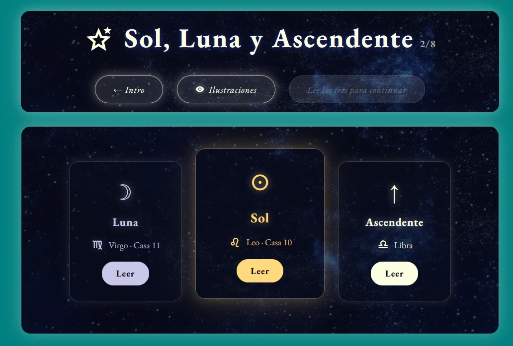

# 8. Diseño

Este capítulo recoge el diseño completo del sistema: cómo se guardan los datos, cómo se organizan los bloques funcionales, qué expone el servidor, qué tecnologías ocupan cada capa, cómo se ha diseñado la interacción y la interfaz, cuál es la guía de estilos y cómo se ha planificado la validación.

Cada apartado se relaciona con los requisitos del capítulo anterior, indicando entre paréntesis los identificadores que resuelve.

## 8.1. Diseño de la persistencia

### 8.1.1. El problema: recorridos que crecen

El primer diseño de la base de datos, el que se usó durante las dos primeras disciplinas, era el convencional: una tabla por concepto, una columna por dato. La tabla de astrología tenía columnas para el signo solar, el lunar, el ascendente, las casas… y la de psicología iba a tener columnas para cada pregunta de la línea de vida.

Ese diseño se rompió en la tercera semana de la segunda disciplina. El motivo es la naturaleza del producto: **un recorrido no es un formulario cerrado, es una estructura que crece**. Añadir un paso nuevo a Psicología —y se añadieron veintiséis— habría significado una migración de esquema cada vez; permitir que un usuario añada un número indeterminado de heridas, cada una de ellas relacionada con un número indeterminado de recuerdos y de creencias, no encaja en columnas fijas sin construir cinco tablas de relación; y el recorrido de Fisiología ni siquiera existía todavía cuando había que decidir la forma de sus datos.

### 8.1.2. La solución: un documento por disciplina y por usuario

El modelo definitivo separa dos cosas que antes estaban mezcladas:

**Lo que el sistema necesita consultar y agregar** —quién es cada usuario, qué ha comprado, qué cursos existen, quién está suscrito— vive en **tablas relacionales normales**, con columnas, tipos e índices, porque sobre eso hay que hacer consultas.

**Lo que solo tiene sentido para un usuario concreto** —todo su progreso dentro de una disciplina— vive en **una única fila y una única columna de tipo JSONB**, con el identificador del usuario como clave primaria.

```
metodo_psicologia
├── user_id     text        primary key
├── data        jsonb       not null default '{}'
└── updated_at  timestamptz not null default now()
```

El servidor solo permite escribir el campo `data`, y lo hace mediante una operación de inserción o actualización (*upsert*) por identificador de usuario. Hay una tabla con esta misma forma para cada disciplina.

Las ventajas de este diseño resultaron ser decisivas para que el proyecto pudiera terminar con ocho disciplinas:

- **Añadir un paso no requiere migrar nada.** Los campos nuevos se guardan y se leen tal cual (RNF-11).
- **Estructuras anidadas de profundidad variable** —un año de la línea de vida que contiene respuestas, que contienen huellas marcadas— se representan de forma natural.
- **Borrar los datos de un usuario es borrar ocho filas**, lo que simplifica enormemente el ejercicio del derecho de supresión (RNF-09).

Y una desventaja, que costó cara y que se documenta en el capítulo 9: **la base de datos ya no valida la forma del dato**. Si una versión antigua guardó un campo como texto y una versión nueva espera una lista, la base de datos lo acepta sin protestar y el fallo aparece al pintar la pantalla. La respuesta a este problema fue triple: blindar la lectura comprobando el tipo de cada campo antes de usarlo, documentar la forma esperada del documento como comentario dentro del propio fichero de esquema, y añadir una barrera de error global que muestra una pantalla de fallo en lugar de dejar la página en blanco (RNF-05).

### 8.1.3. Modelo de datos

El esquema resultante, representado en la Figura 5, tiene por tanto dos mitades bien diferenciadas: un núcleo relacional sobre el que se consulta y se agrega, y ocho documentos que solo se leen enteros y solo para un usuario.

[FIGURA 5: esquema del modelo de datos completo]

*Figura 5. Esquema del modelo de datos: tablas relacionales y documentos JSONB.*
*(Fuente propia)*

**Núcleo relacional**

- **`user`** — identidad, credenciales, datos de perfil y, para cada una de las ocho disciplinas, un par de columnas: un indicador booleano de acceso concedido y la fecha de compra. Este par es lo que consulta el sistema para decidir si deja entrar a un recorrido (RF-45, RF-49).
- **`curso`** — catálogo de cursos con su disciplina, portada, modalidad y lecciones (RF-11, RF-52).
- **`video`** — piezas de vídeo con su portada y su disciplina (RF-52).
- **`suscriptor`** — personas suscritas al boletín, con su fecha de alta y su estado (RF-15, RF-55).
- **`astrologia_arquetipos`** — textos interpretativos editables desde el panel sin publicar código (RF-53).
- **`estudio_participante`** y **`estudio_respuesta`** — datos del estudio estadístico abierto, separados en dos tablas porque sobre las respuestas hay que hacer agregaciones por planeta, signo y pregunta (RF-41).
- **`recorrido_progreso`** — posición alcanzada por cada usuario en cada disciplina, en tabla aparte porque se consulta con frecuencia y de forma independiente al contenido (RF-21, RF-24).

**Documentos por disciplina**

Ocho tablas de la forma descrita —`metodo_astrologia`, `metodo_psicologia`, `metodo_ayurveda`, `metodo_tcm`, `metodo_fisiologia`, `metodo_nutricion`, `metodo_cabala` y la de cultura— más `psicologia_des` para el cuestionario DES-II, separado del resto por tratarse de un instrumento con estructura propia y estable.

A modo de ejemplo, esta es la forma del documento de Psicología, el más complejo del sistema:

```
data {
  "problema-actual": "texto libre",
  "edad": 22,
  "anos": {
    "0": { "respuestas": { … }, "sinRecuerdos": false,
           "huellas": ["recuerdo marcado", …] },
    "1": { "sinRecuerdos": true },
    …
  },
  "nudos":   ["Miedo al abandono", "Perfeccionismo", …],
  "heridas": [ { "id", "titulo", "texto",
                 "huellas": […], "nudos": […] } ],
  "constelaciones": [ { "id", "titulo", "texto",
                        "nudos": […],
                        "arquetipos": [ { "cuerpoKey": "saturno",
                                          "faceta": "casa", "casa": 1 } ] } ]
}
```

El último campo ilustra por qué el modelo documental era necesario: una *constelación* relaciona creencias identificadas por el usuario en Psicología con arquetipos procedentes de su carta natal en Astrología. Representar esa relación entre dos disciplinas en un modelo estrictamente relacional habría exigido tres tablas más y consultas con varias uniones, para un dato que solo se consulta entero y solo para un usuario.

### 8.1.4. Seguridad e integridad

El servidor accede a la base de datos con una clave de servicio que omite las reglas de seguridad por fila, de modo que **la autorización se decide íntegramente en el servidor**: cada petición comprueba la credencial de sesión y el indicador de acceso a la disciplina antes de leer o escribir nada. Esta decisión centraliza el control en un solo sitio, que es más fácil de auditar que un conjunto de reglas declarativas repartidas por tablas.

Las imágenes subidas por los usuarios —fotografías de perfil y de genograma— y por la administración se guardan en un único depósito público de almacenamiento gestionado, cuya dirección se registra en la base de datos. Es importante señalar que **ese depósito debe seguir siendo público**: como las direcciones se almacenan directamente en los registros, restringirlo dejaría todas las imágenes rotas. Para material que sí deba ser privado —como los libros en PDF vendidos— la solución correcta es un depósito distinto con acceso restringido.

Las copias de seguridad quedan cubiertas por el servicio gestionado de base de datos; el esquema completo, con sus comentarios, está versionado en el repositorio como ficheros SQL ejecutables, de forma que el sistema puede reconstruirse desde cero.

## 8.2. Diseño de la arquitectura conceptual

El sistema se organiza en tres niveles, con servicios externos acoplados en los bordes, según el reparto que muestra la Figura 6.

[FIGURA 6: diagrama de la arquitectura conceptual]

*Figura 6. Arquitectura conceptual del sistema.*
*(Fuente propia)*

**Nivel de presentación.** Aplicación de una sola página que se ejecuta íntegramente en el navegador. Contiene el enrutado, las pantallas, los componentes reutilizables, el sistema de traducción, el taller de generación de documentos PDF y el motor de representación tridimensional. Se comunica con el nivel de negocio exclusivamente por HTTP.

**Nivel de negocio.** Servidor de API REST organizado en módulos independientes, uno por área funcional. Es el único que conoce las credenciales de la base de datos, las claves de la pasarela de pago y las del servicio de correo. Aquí viven las tres piezas de lógica que **no pueden estar en el cliente** bajo ningún concepto: la autorización de acceso a cada disciplina, la fijación de los precios y el cálculo de la carta natal.

**Nivel de persistencia.** Base de datos relacional gestionada y almacenamiento de ficheros.

**Servicios externos.** Pasarela de pago, proveedor de identidad, servicio de geocodificación para resolver las coordenadas del lugar de nacimiento y servicio de correo saliente.

Una decisión de arquitectura merece destacarse: **el cálculo de la carta natal se hace en el servidor y no en el cliente**, aunque la biblioteca astronómica funcionaría igual de bien en el navegador. El motivo es que el resultado es el producto que el usuario ha comprado: si se calculara en el cliente, cualquiera podría obtenerlo sin pagar leyendo el código de la propia página.

## 8.3. Diseño de la API REST

El servidor expone alrededor de **treinta módulos** y un centenar largo de puntos de acceso. La convención seguida es la habitual de REST: el recurso en la ruta, la acción en el método HTTP, y el identificador del usuario como último segmento en los recursos personales.

[TABLA 15: resumen de la API REST]

*Tabla 15. Resumen de los módulos de la API REST y sus operaciones principales.*

| Módulo | Ruta base | Operaciones principales |
|---|---|---|
| Usuarios | `/user` | Registro, inicio de sesión, recuperación de contraseña, perfil, baja; operaciones de administración sobre accesos y usuarios |
| Autenticación externa | `/auth` | Inicio y retorno del flujo OAuth de Google |
| Carta natal | `/metodo-astrologia` | Obtener y recalcular la carta natal, actualizar datos de nacimiento, solicitar lectura, operaciones de administración sobre textos |
| Recorridos | `/metodo-<disciplina>` | Dos operaciones por disciplina: obtener el documento del usuario y actualizarlo parcialmente |
| Progreso | `/recorrido-progreso` | Consultar la posición alcanzada y avanzar |
| Notas | `/notas` | Crear, listar y eliminar notas personales |
| Pagos | `/payment` | Crear sesión de pago y verificar el resultado, por disciplina y por tipo de producto; recepción del aviso firmado de la pasarela |
| Cursos | `/cursos` | Listado público, listado completo de administración, detalle, alta, edición y baja |
| Vídeos | `/videos` | Listado, detalle y operaciones de administración |
| Estudio | `/estudio` | Alta de participante, envío de respuestas, resultados agregados y estadísticas |
| Suscripción | `/subscribe` | Alta, baja y listado de administración |
| Reservas | `/booking` | Consultar huecos ocupados y reservar |
| Contacto | `/contact` | Envío del formulario |
| Opiniones | `/opinion` | Alta y listado |
| Subida de ficheros | `/upload` | Fotografía de perfil, imágenes de genograma y portadas |

Dos criterios de diseño gobiernan toda la API:

**Los recorridos comparten interfaz.** Las ocho disciplinas exponen exactamente las mismas dos operaciones: una lectura y una actualización parcial del documento. Esto permite que el cliente use un único mecanismo de guardado para todas, y es la contrapartida en el servidor del sistema común de recorridos del apartado 8.5.

**El cliente nunca envía dinero.** En todas las operaciones de pago, el cuerpo de la petición contiene únicamente el identificador del producto; el importe lo determina el servidor a partir de tablas propias (R-07). El aviso de la pasarela se verifica criptográficamente sobre los bytes exactos recibidos, para lo cual el servidor conserva el cuerpo sin procesar de esa petición concreta.

## 8.4. Diseño de la arquitectura tecnológica

Las tecnologías comparadas en el apartado 4.4 se reparten sobre la arquitectura anterior como muestra la Figura 7.

[FIGURA 7: pila tecnológica por niveles]

*Figura 7. Pila tecnológica repartida sobre la arquitectura conceptual.*
*(Fuente propia)*

**Cliente.** React 19 con TypeScript, construido con Vite. El enrutado se resuelve con React Router y, de forma deliberada, **cada página se carga de manera diferida**: cada pantalla viaja en su propio fragmento de código y se descarga solo al entrar en ella. Esta decisión no es un adorno de rendimiento, sino la respuesta a un problema real descrito en el capítulo 9: la aplicación llegó a producir un único paquete de 6 MB que había que descargar entero para ver la portada.

**Servidor.** NestJS sobre Node.js, con módulos por área funcional. Incorpora cabeceras de seguridad, restricción de orígenes configurable por variable de entorno —para poder estrenar dominio sin volver a publicar— y limitación de peticiones por dirección de origen. El servidor declara explícitamente que confía en el proxy del proveedor de despliegue: sin esa configuración, todas las peticiones parecerían venir de la misma dirección y el límite se aplicaría a todos los usuarios en común, lo que dejaría la plataforma fuera de servicio con apenas unas pocas personas dentro.

**Persistencia.** PostgreSQL gestionado y almacenamiento de objetos.

**Despliegue.** Sitio estático para el cliente y servicio web para el servidor, ambos publicados automáticamente desde la rama principal del repositorio.

## 8.5. Diseño de la interacción

### 8.5.1. El mapa: ocho puertas sin orden obligatorio

La primera decisión de interacción fue **no imponer un camino entre disciplinas**. La página de bienvenida presenta las ocho como iguales, y cada una se abre cuando el usuario quiere. Existe un orden recomendado —el que sigue la numeración— pero es un consejo, no una puerta cerrada.

El motivo es comercial y pedagógico a la vez: obligar a comprar Astrología para poder acceder a Nutrición convertiría el producto en una escalera, y quien llega interesado en nutrición se iría. Dentro de cada disciplina, en cambio, el orden sí es obligatorio, porque cada paso se apoya en el anterior.

Al pulsar una disciplina se llega a su **portada común**, con tres puertas: *Ilustraciones*, *Cursos* y *El Recorrido*. Las dos primeras son públicas; la tercera exige haber adquirido la disciplina.

### 8.5.2. El Recorrido: la unidad de diseño

Todo el producto gira alrededor de una misma estructura, que se diseñó una vez y se reutiliza ocho veces (SO-2):

**Cabecera de paso.** Siempre en el mismo sitio: el icono de la disciplina —con un movimiento suave de flotación—, el título del paso, y a los lados los botones de navegación: anterior, índice y siguiente.

**Cuerpo del paso.** El contenido, que puede ser texto, un test, un mapa interactivo, un formulario o una ilustración.

**Botones de final de página.** Fuera de la caja de contenido, siempre en la misma posición: **avanzar abajo a la derecha, volver abajo a la izquierda**. Esta regla se rompió al principio en varias pantallas y producía una desorientación constante; unificarla en un único componente fue una de las mejoras de usabilidad más rentables del proyecto (RNF-01).

**Índice.** Accesible desde la cabecera. Muestra todos los pasos de la disciplina e indica hasta dónde puede llegar el usuario. Un detalle de diseño importante: el índice **no** ofrece únicamente los pasos ya visitados, sino todos los *alcanzables* —aquellos cuyas condiciones previas se cumplen—, de forma que quien vuelve tras varios días pueda saltar directamente a donde lo dejó sin recorrer de nuevo lo leído.

**Desbloqueo por lectura.** Un paso se habilita cuando el anterior se ha recorrido, no cuando se ha superado con una nota. Las únicas puertas duras del sistema son los tests cuyo resultado determina el resto del recorrido —el de constitución ayurvédica y el de constitución en Medicina China—, que son obligatorios porque sin ellos los pasos siguientes no tendrían qué mostrar (RF-24).

La Figura 8 muestra estas cuatro piezas funcionando juntas en un paso real del recorrido de Astrología: la cabecera con el icono de la disciplina y el contador de posición, los botones de navegación a los lados y, a la derecha, el botón de avance todavía deshabilitado con el motivo escrito en él —«Lee los tres para continuar»—. Decir *por qué* no se puede avanzar, en lugar de limitarse a desactivar el botón, evita que el usuario se quede bloqueado sin saber qué le falta.



*Figura 8. Cabecera de paso y desbloqueo por lectura: el botón de avance indica qué falta para habilitarse.*
*(Fuente propia)*

[FIGURA 9: mapa de interacciones del recorrido]

*Figura 9. Mapa de interacciones de un recorrido tipo.*
*(Fuente propia)*

### 8.5.3. El cómic: cómo se lee lo que hay que leer

Un recorrido de veinte pantallas de párrafos no se termina. La solución adoptada es el **cómic inmersivo**: un visor a pantalla completa con la ilustración a la izquierda y el texto a la derecha, que el usuario hace avanzar a su ritmo y que puede abandonar en cualquier momento.

Los cómics aparecen en tres situaciones:

- **Al entrar en una disciplina** (el cómic del Origen), como introducción a la materia.
- **Intercalados entre dos pasos**, cuando hay contexto que conviene dar antes de continuar.
- **Como contenido en sí mismo**, en los casos en que el texto es narrativo: cada chakra, por ejemplo, se lee dentro de su propio cómic y no en una página.

Todo lo que contiene una ilustración de fondo —no solo los cómics— sigue la misma estructura visual: imagen a la izquierda, texto grande a la derecha con desplazamiento propio. La coherencia de ese patrón en las ocho disciplinas es lo que hace que el producto se perciba como una sola cosa (RF-26).

### 8.5.4. Guardado y recuperación

El progreso se guarda de forma continua y automática. El usuario nunca pulsa «guardar». Dos reglas de diseño sostienen esta promesa (RF-21, RF-22, SO-3):

**Siempre se prerrellena.** Al entrar en cualquier pantalla se consulta lo que el usuario ya contestó y se muestra rellenado. No se le pregunta dos veces por lo mismo.

**Se espera al guardado antes de navegar.** Si la pantalla siguiente comprueba un indicador que acaba de escribirse, navegar antes de que el guardado llegue al servidor produce un rebote: la aplicación devuelve al usuario al paso anterior porque, para el servidor, todavía no lo ha completado. El sistema incorpora por ello un mecanismo de vaciado de la cola de guardado que se invoca antes de cambiar de pantalla.

### 8.5.5. Animación y percepción de velocidad

Las animaciones de entrada están ligadas a la aparición del elemento en pantalla, no al montaje de la página: nada que esté por debajo del pliegue se anima hasta que el usuario llega a ello. Los elementos de una misma fila aparecen con un desfase de aproximadamente un tercio de segundo, lo que produce una cascada legible sin resultar lenta.

Las pantallas de carga son propias de cada disciplina —la manzana en Nutrición, la estrella en Astrología— y fuera del recorrido se usa el mandala de la marca. La pantalla de carga se muestra mientras se descarga el fragmento de código de la página y mientras se precargan las ilustraciones necesarias, de modo que el contenido nunca aparece a medias.

## 8.6. Diseño de las interfaces

### 8.6.1. Proceso seguido

El diseño de interfaz se abordó con **prototipos de fidelidad creciente**: bocetos rápidos para decidir la disposición de cada pantalla nueva, y prototipos de alta fidelidad únicamente para las pantallas que se repiten (la cabecera de paso, la caja con ilustración, la tarjeta de disciplina, el visor de cómic), porque esas se construyen una vez y se usan cientos.

Para el resto de pantallas se optó deliberadamente por **prototipar en el propio código**. Con una sola persona en el proyecto, dibujar una pantalla en una herramienta de diseño y después construirla supone hacer el mismo trabajo dos veces; teniendo ya construidos los componentes comunes, montar una pantalla nueva con ellos es casi tan rápido como dibujarla y produce algo que funciona.

### 8.6.2. Catálogo de componentes comunes

El sistema se apoya en un catálogo de componentes que resuelven, cada uno, una decisión visual que se repite (RNF-10):

[TABLA 16: componentes comunes]

*Tabla 16. Componentes comunes reutilizados en las ocho disciplinas.*

| Componente | Función |
|---|---|
| Cabecera de paso | Icono flotante, título y botones de navegación del recorrido |
| Botón de paso | Avanzar (abajo derecha) y volver (abajo izquierda), fuera de la caja de contenido |
| Marca de leído | Círculo con el color de fondo de la disciplina y tick con su color de texto, arriba a la derecha del elemento |
| Visor de cómic | Ilustración, texto con desplazamiento propio, barra de desplazamiento propia y botones de saltar y continuar |
| Caja con ilustración | Imagen a la izquierda, texto grande a la derecha; misma estructura que el cómic, sin separador |
| Tarjeta con fotografía | Imagen arriba, línea, título abajo a la izquierda; la tarjeta entera es el botón, sin botón «ver» |
| Índice de recorrido | Lista de pasos con indicación de hasta dónde se puede llegar |
| Pantalla de carga | Animación propia de cada disciplina durante la descarga del fragmento y la precarga de imágenes |
| Panel animado | Caja con balanceo en reposo y realce al pasar por encima, usada en las páginas de doṣha |
| Ficha modal | Ventana común para células, consejos y sistemas en Fisiología |

### 8.6.3. El taller de documentos PDF

La generación de los documentos personales (RF-42 a RF-44) exigió construir una pieza propia que merece un apartado, porque es uno de los componentes más delicados del sistema.

La biblioteca elegida dibuja en el documento, pero **no maqueta**: no hay saltos de línea automáticos, ni saltos de página, ni control de viudas. Todo eso hay que calcularlo. El taller construido resuelve ese problema con una arquitectura de dos pasadas: primero se **mide** el contenido para saber cuánto espacio ocupa y dónde hay que partir la página, y después se **pinta**. La clave del diseño es que ambas pasadas ejecutan exactamente el mismo código, con un indicador que decide si se dibuja o solo se acumulan medidas; cualquier otra solución produce documentos en los que la medida y el resultado se desincronizan.

El taller se compone de un módulo de composición de apuntes, uno de formas geométricas, uno de imágenes, uno de glifos dibujados y uno de temas visuales, y da servicio a los generadores de las ocho disciplinas.

Dos limitaciones del formato, descubiertas durante el desarrollo y documentadas para quien continúe el proyecto: la tipografía serif embebida **no incluye** algunos caracteres que se usan habitualmente en los textos —flechas, marcas de verificación, diacríticos de la transliteración sánscrita, alfabeto hebreo—, que desaparecen sin dar ningún error; y la gestión de transparencia solo afecta a los rellenos, no a los trazos.

## 8.7. Guía de estilos

### 8.7.1. Color

La identidad visual se apoya en un **fondo turquesa** (`#008080`) que es constante en toda la plataforma. Es la regla más estricta del sistema: el fondo de página es siempre ese color, y **nunca** una imagen a pantalla completa. Las ilustraciones aparecen dentro de cajas, nunca detrás del contenido.

Sobre ese fondo, cada disciplina aporta su propio par de colores: uno de fondo, para cajas, líneas y botones, y otro de texto, exclusivamente para la letra dentro de esas cajas.

[TABLA 17: paleta por disciplina]

*Tabla 17. Paleta de color de cada disciplina.*

| Disciplina | Color de fondo | Color de texto |
|---|---|---|
| Astrología | `#1e296b` | `#feffe4` |
| Psicología | `#daa889` | `#5e2d10` |
| Ayurveda | `#ffffff` | `#853e0b` |
| Medicina China | `#6b0404` | `#ffa2a2` |
| Fisiología | `#331c35` | `#c8b5d1` |
| Nutrición | `#e4f8e1` | `#2b362a` |
| Cábala | `#3b2612` | `#bd814d` |
| Cultura | `#0c3c3c` | `#79dcd4` |

Tres reglas gobiernan el uso del color y se aplican sin excepción:

**El color de texto de una disciplina solo se usa para letra.** Todo lo demás —cajas, bordes, líneas, botones— usa el color de fondo. Confundir ambos produce composiciones ilegibles.

**Fuera de las cajas, el texto es blanco y sin sombra.** Sobre el turquesa, el color de disciplina no contrasta lo suficiente.

**Ningún halo claro.** Los realces y sombras usan únicamente el color de acento de la disciplina; los halos blancos o claros producen sobre el turquesa un efecto de caja desvaída que rompe la unidad visual.

Para la legibilidad sobre ilustración se usa, por defecto, sombra de texto negra; el velo oscurecedor sobre la imagen se reserva a los dos casos donde la ilustración es demasiado clara para que la sombra baste.

### 8.7.2. Tipografía

La plataforma usa una **tipografía serif** como cuerpo de texto, en coherencia con el carácter del producto —un camino largo que se lee, no una aplicación de consumo rápido— y frente a la tendencia dominante de tipografías de palo seco. Los documentos PDF usan una serif clásica embebida.

### 8.7.3. Interacción visual

- **Nada azul al pulsar.** El resaltado nativo del navegador al tocar, el anillo de foco por defecto de la biblioteca de componentes y el color de selección de texto se sustituyen por los de la marca.
- **El pie de página siempre abajo.** Toda página de ruta usa una altura mínima de pantalla completa con el contenido en crecimiento, para que el pie no suba cuando el contenido es corto.
- **Sin adornos en los títulos.** No se usan símbolos decorativos en titulares ni viñetas; como mucho, una línea fina.
- **Modo oscuro del navegador desactivado.** El sistema declara explícitamente esquema de color claro, porque el ajuste automático de algunos navegadores altera los iconos e imágenes de la interfaz.

### 8.7.4. Adaptación a móvil

Toda la plataforma es adaptativa (RNF-02). Dos decisiones concretas merecen mención: las barras de desplazamiento dentro de los cómics son **propias y no del navegador**, porque en móvil las nativas no se ven y el usuario no sabe que el texto continúa; y los visores de ilustración a pantalla completa desactivan el desplazamiento vertical de la página desde un único punto del código, para que no aparezca nunca una segunda barra detrás del visor.

## 8.8. Diseño de las pruebas y la validación

Dado que el objetivo del proyecto no es el diseño de un sistema de pruebas, la estrategia se centró en obtener garantías suficientes con un coste proporcionado, combinando cuatro niveles.

**Pruebas de la API.** Colección de peticiones mantenida durante el desarrollo, con un caso correcto y un caso erróneo por cada operación relevante, que permite comprobar de una pasada que un cambio no ha roto nada. La atención se concentra en los tres puntos críticos: la autorización de acceso a cada disciplina, la verificación del aviso de pago y la lectura y escritura de los documentos de recorrido.

**Pruebas de recorrido completo.** Cada disciplina se recorre entera, de principio a fin, antes de darse por terminada, comprobando en cada paso que el progreso se guarda, que las respuestas se prerrellenan al volver y que el documento final se genera con los datos correctos. Esta es la prueba que más defectos ha detectado.

**Pruebas con usuarios reales.** Un grupo reducido de personas ajenas al proyecto recorre una disciplina completa y responde después un cuestionario sobre claridad de la navegación, comprensión del contenido, utilidad del documento obtenido y dificultades encontradas. El cuestionario se diseñó para responder a preguntas concretas del producto y no de forma genérica: dónde se atascan, si entienden qué es cada disciplina antes de comprarla, y si el documento final les parece valioso.

**Indicadores de rendimiento y peso.** Se fijan umbrales medibles: tamaño del fragmento inicial de código, peso total del material servido por pantalla y consumo mensual de ancho de banda frente al límite del plan de despliegue. Estos indicadores existen porque el riesgo R-04 se consideró probable desde el principio.

El diseño y los resultados concretos de estas pruebas se detallan en el capítulo 10.
