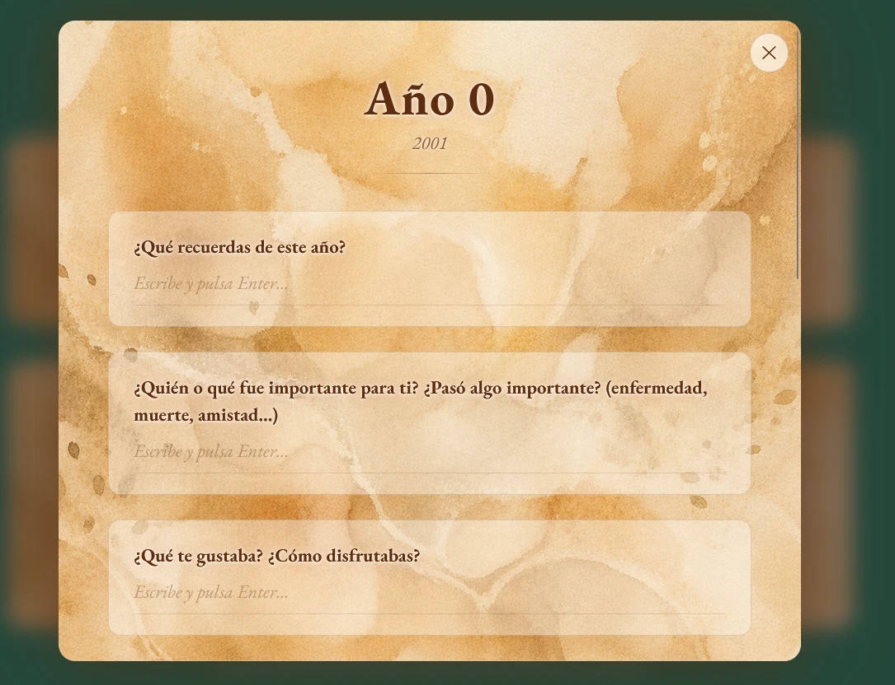

# 9. Implementación

Este capítulo documenta el desarrollo real del proyecto, organizado en las ocho fases en que efectivamente se produjo. No coincide del todo con la planificación del capítulo 3, y esa diferencia es en sí misma un resultado: se analiza en el apartado 11.2.

El historial de control de versiones registra **541 versiones** entre febrero y septiembre, repartidas de forma muy desigual: hay un mes que concentra casi un tercio de todo el trabajo registrado del proyecto. Cada fase se documenta con su objetivo, lo que se construyó, los problemas que aparecieron y las decisiones que se tomaron.

## 9.1. Fase 0 — Entorno y esqueleto (febrero)

**Objetivo:** tener una aplicación que arranque, se despliegue y guarde algo.

Se creó el repositorio, se montó la estructura de carpetas y se validó la pila tecnológica completa antes de construir nada de producto, en aplicación directa del plan de prevención del riesgo R-07.

La primera decisión que hubo que rectificar fue la base de datos. El proyecto arrancó contra una base de datos MySQL local servida por XAMPP —la configuración habitual del entorno de aprendizaje— y llegó a funcionar. El problema apareció al pensar en el despliegue: una base de datos local no sirve para una aplicación publicada, y alquilar un servidor propio contradecía la restricción de presupuesto (R-02). Se migró a PostgreSQL gestionado. La migración costó poco porque se hizo pronto, que es exactamente el motivo por el que la fase 0 existe.

Se construyeron en esta fase el registro y el inicio de sesión con credencial de sesión firmada, el modelo de usuario, la subida de fotografía de perfil, la portada, el logotipo y la identidad visual base, y las primeras páginas informativas.

**Lo que se aprendió:** validar el despliegue en la primera semana, y no en la última, habría sido aún mejor. Varias decisiones de la fase 1 se tomaron sin saber todavía qué limitaciones imponía el entorno de publicación.

## 9.2. Fase 1 — La capa pública (marzo–abril)

**Objetivo:** que la plataforma tenga algo que enseñar antes de tener recorridos.

Esta fase construyó todo lo que se ve sin haber comprado nada: el catálogo de cursos con sus lecciones en vídeo y en texto, las páginas de materiales descargables, la sección de productos, las opiniones, el formulario de contacto y el primer panel de administración.

Se añadió también el acceso mediante cuenta de Google, que reduce la fricción del registro. Su implementación obligó a resolver el retorno del flujo de autorización en una aplicación de una sola página, donde el proveedor redirige a una dirección que la aplicación debe interceptar para recoger la credencial.

Abril fue el mes de menor actividad registrada de todo el proyecto: 27 versiones frente a las 67 de marzo. La razón no fue una parada, sino un cambio de naturaleza del trabajo: buena parte de abril se dedicó a **producir contenido** —cursos, textos, ilustraciones— que no genera código y, por tanto, no aparece en el historial. Es la limitación de medir el esfuerzo por versiones registradas que ya se advertía en el apartado 6.3.3.

## 9.3. Fase 2 — Astrología: la primera disciplina (mayo)

**Objetivo:** el primer recorrido completo, de principio a fin, con su documento final.

Esta es la fase que definió la forma del producto. Todo lo que después se reutilizó ocho veces se inventó aquí.

### 9.3.1. El cálculo de la carta natal

La pieza técnicamente más exigente del proyecto. El servicio recibe fecha, hora y lugar de nacimiento y devuelve la carta completa. El proceso tiene cuatro pasos:

1. **Resolver el lugar.** El nombre del lugar de nacimiento se convierte en coordenadas mediante un servicio de geocodificación abierto.
2. **Resolver la hora real.** A partir de las coordenadas se determina la zona horaria **histórica** —no la actual— y se convierte la hora local a tiempo universal. Este paso es crítico: una hora de error desplaza el ascendente unos quince grados, lo que en muchos casos cambia el signo. Los cambios de huso y de horario de verano a lo largo del siglo XX hacen que este cálculo no sea trivial.
3. **Calcular posiciones.** Se obtienen las longitudes eclípticas de los diez cuerpos del sistema solar, más los puntos angulares y las cúspides de las casas.
4. **Calcular aspectos.** Se comparan todos los pares de cuerpos buscando las siete separaciones angulares consideradas —conjunción, semisextil, sextil, cuadratura, trígono, quincuncio y oposición— dentro de un margen de tolerancia.

El cuarto paso obligó a una decisión de diseño que no era evidente. El margen de tolerancia (el *orbe*) no es una constante: depende del aspecto y de la categoría del cuerpo. Se implementó una tabla completa de orbes por categoría —planetas, nodos, asteroides, puntos angulares, cúspides— siguiendo el criterio de una referencia establecida del sector, y una regla para los casos mixtos: cuando dos cuerpos de categorías distintas forman un aspecto, se usa el **menor** de los dos orbes. Toda la tabla está aislada en constantes documentadas, de forma que cambiar el criterio sea editar unos números y no reescribir el algoritmo.

### 9.3.2. El recorrido y el desbloqueo por lectura

Sobre la carta calculada se construyó el recorrido: puntos clave, planetas, casas y aspectos, cada tramo desbloqueado por la lectura del anterior, con el estado de lectura guardado en la base de datos para que sobreviva al cambio de dispositivo.

Aquí se estableció el patrón de desbloqueo que después se aplicó a todo el producto (RF-24), y aquí apareció también el primer cómic: una introducción ilustrada a la historia de la astrología que se muestra al entrar en la disciplina. Funcionó tan bien como recurso de lectura que el cómic pasó de ser un añadido a ser un componente estructural del sistema.

### 9.3.3. El documento en PDF

El generador de la carta astral en PDF fue el primer contacto con el problema descrito en el apartado 8.6.3: la biblioteca dibuja pero no maqueta. La primera versión calculaba las posiciones de forma aproximada y producía documentos con texto cortado y páginas desequilibradas. La reescritura introdujo la arquitectura de dos pasadas —medir y pintar con el mismo código— que después se convirtió en el taller común.

## 9.4. Fase 3 — Psicología y la reescritura de la persistencia (junio)

**Objetivo:** la segunda disciplina; y, sin haberlo previsto, rehacer cómo se guarda todo.

Psicología es el recorrido más largo del producto: veintiséis pantallas que incluyen la línea de vida año a año, el genograma familiar, dos cuestionarios validados y la construcción del mapa personal de huellas, nudos y heridas.

La pieza central es la línea de vida. El usuario indica su edad y el sistema genera una línea temporal con un nodo por año; al pulsar cada nodo se abre la página de ese año con preguntas evocadoras, como muestra la Figura 10. El diseño es deliberadamente el de una página de libro y no el de un formulario: la metáfora —escribir el propio libro autobiográfico— es lo que hace que alguien esté dispuesto a recorrer veintidós años uno a uno. Cualquier año puede marcarse como «sin recuerdos» y continuar, decisión de diseño que se justifica en el apartado 12.3.

*Figura 10. Página de un año dentro de la línea de vida, con las preguntas evocadoras del recorrido de Psicología.*
*(Fuente propia)*

### 9.4.1. El modelo de datos se rompió

Al llegar a las heridas —relaciones entre un número indeterminado de recuerdos y un número indeterminado de creencias, todas creadas por el usuario— quedó claro que el modelo de columnas fijas no aguantaba. La alternativa era construir cinco tablas de relación más, sabiendo que la disciplina siguiente traería otras cinco.

Se tomó la decisión descrita en el apartado 8.1: **un único documento JSONB por disciplina y usuario**. Migrar lo ya construido costó unos días. No haberlo hecho habría hecho imposible terminar seis disciplinas más.

### 9.4.2. Los cuestionarios validados

Se implementaron los cuestionarios ACE —experiencias adversas en la infancia— y DES-II —experiencias disociativas. Ambos son instrumentos reconocidos, y su implementación planteó un problema que no era técnico sino de responsabilidad: **qué se le dice al usuario con el resultado**. La decisión, que se desarrolla en el capítulo 12, fue presentar siempre el resultado acompañado de su interpretación correcta, dejando explícito que se trata de un instrumento de cribado y en ningún caso de un diagnóstico.

El cuestionario DES-II se guardó en tabla propia y no en el documento general, por tratarse de un instrumento con estructura fija y estable sobre el que sí conviene poder consultar de forma agregada.

### 9.4.3. El problema del rebote

Apareció aquí un fallo recurrente que costó tiempo entender: al terminar un paso y avanzar, la aplicación devolvía al usuario al paso anterior. La causa era una condición de carrera: la pantalla siguiente comprobaba en el servidor un indicador que el guardado de la pantalla anterior todavía no había llegado a escribir. La solución fue un mecanismo explícito de vaciado de la cola de guardado, que se invoca antes de navegar (apartado 8.5.4).

## 9.5. Fase 4 — Ayurveda y la extracción del sistema común (finales de junio)

**Objetivo:** la tercera disciplina; y comprobar si el producto era replicable.

Esta fase fue la prueba de la apuesta declarada en el apartado 3.3. Se construyó el test de constitución, el recorrido del doṣha resultante y sus pantallas —cuerpo, desequilibrio, cuidados, estilo de vida, rutina diaria, respiración—, pero el trabajo principal no fue ese, sino **extraer a componentes comunes todo lo que ya se había escrito dos veces**: la cabecera de paso, los botones de avance, la marca de leído, el índice, el visor de cómic, la pantalla de carga.

El resultado confirmó la hipótesis: a partir de esta fase, construir una disciplina nueva pasó a ser mayoritariamente escribir contenido y colocar componentes ya existentes. Sin esta extracción el proyecto habría terminado con cuatro disciplinas, no con ocho.

Se introdujo también aquí el test como **puerta obligatoria**: sin constitución determinada, los pasos siguientes no tienen qué mostrar, así que el sistema impide avanzar. Es una de las dos únicas puertas duras del producto.

## 9.6. Fase 5 — El lanzamiento público (julio)

**Objetivo:** convertir un proyecto en un producto publicado.

Julio concentra **174 versiones registradas**, casi un tercio del total del proyecto. Fue el mes en que todo lo que faltaba para poder abrir la puerta al público se construyó a la vez.

### 9.6.1. Pagos

Se integró la pasarela de pago con tres decisiones de diseño que resultaron acertadas:

**El precio lo fija el servidor.** El navegador envía únicamente el identificador del producto. Un cliente manipulado no puede comprar una disciplina por un céntimo (R-07).

**Acreditación redundante.** El acceso se concede por dos caminos independientes: el aviso firmado que la pasarela envía al servidor, y una verificación explícita cuando el usuario vuelve del pago. Si uno falla, el otro acredita la compra. Y si fallan los dos, existe un tercer recurso: la concesión manual desde el panel de administración.

**Verificación criptográfica sobre el cuerpo sin procesar.** La firma del aviso se calcula sobre los bytes exactos que envía la pasarela, de modo que el servidor debe conservar el cuerpo original de esa petición concreta además del objeto ya interpretado. Es un detalle fácil de pasar por alto que invalida silenciosamente toda la verificación.

Durante el desarrollo existió un mecanismo de «pago de prueba» que concedía el acceso sin cobrar. Antes de la publicación se **eliminó por completo del código**, tanto del cliente como del servidor, y se sustituyó por dos vías legítimas de acceso gratuito: una lista de correos con acceso concedido y el panel de concesión manual. Dejar un atajo de desarrollo en una aplicación publicada es una de las formas más habituales de regalar un producto sin darse cuenta.

### 9.6.2. Cuentas, legales y consentimiento

Se completó la recuperación de contraseña por correo, la eliminación de cuenta con borrado efectivo de todos los datos asociados, las cuatro páginas legales y el aviso de cookies con consentimiento previo: no se carga ningún recurso de analítica hasta que el usuario acepta, y la elección se recuerda entre visitas (RF-19, RNF-09).

El borrado de cuenta planteó un problema concreto: la base de datos no borra en cascada, de modo que eliminar la fila del usuario dejaba huérfanos sus ocho documentos de recorrido, sus notas y sus imágenes. Se implementó un borrado explícito con una lista de tablas relacionadas mantenida en un único punto del código, con una advertencia documentada: **toda tabla nueva que guarde un identificador de usuario debe añadirse a esa lista**.

### 9.6.3. Seguridad del servidor

Se añadieron cabeceras de seguridad, restricción de orígenes configurable mediante variable de entorno —para poder estrenar dominio sin volver a publicar— y limitación de peticiones por dirección de origen.

Esta última tenía un fallo grave que se detectó antes de publicar: en el entorno de despliegue, las peticiones llegan a través de un balanceador, de modo que sin configurar explícitamente la confianza en el proxy **todas las peticiones parecían venir de la misma dirección**. El límite se habría aplicado a todos los usuarios en común y la plataforma se habría bloqueado con cuatro personas dentro.

### 9.6.4. Robustez de los datos

Con usuarios reales a la vista, apareció la contrapartida del modelo documental: **los datos guardados con formas antiguas rompían el pintado de la pantalla**, dejando la página en blanco. El caso típico: un campo que en una versión anterior era un texto y que la versión nueva recorre como lista.

Se abordó en dos frentes. Primero, **blindar la lectura**: comprobar el tipo de cada campo antes de usarlo, y no solo el que dio problemas la primera vez, porque el siguiente fallo siempre viene de otro campo. Segundo, **una barrera de error global** que captura cualquier fallo de pintado y muestra una pantalla de error legible en lugar de una página vacía. Un error que se ve es un error que se puede contar; una página en blanco no.

### 9.6.5. Rendimiento: el paquete de 6 MB

Al preparar la publicación se descubrió que la aplicación producía **un único paquete de código de 6 MB** que el navegador tenía que descargar entero antes de poder pintar la portada.

La solución fue la **carga diferida por ruta**: cada pantalla viaja en su propio fragmento y se descarga solo al entrar en ella. Se dejaron deliberadamente fuera de la carga diferida las piezas que deben poder pintarse antes de que llegue todo lo demás, empezando por la propia pantalla de carga. Este es uno de esos casos en que la solución es de una línea por pantalla, pero solo funciona si la arquitectura lo permitía desde el principio.

## 9.7. Fase 6 — Fisiología, Nutrición, Cábala y el resto del contenido (agosto)

**Objetivo:** completar el catálogo de disciplinas y resolver el peso del material.

Agosto registra 108 versiones y es la fase en que la inversión de la fase 4 rindió: tres disciplinas nuevas —Fisiología, con su viaje de la partícula al organismo; Nutrición, con el cálculo de necesidades y el diseño del día alimentario; Cábala, con el Árbol de la Vida— más ampliaciones sustanciales de las existentes (los chakras en Ayurveda, la rueda de las emociones en Psicología).

### 9.7.1. Adelgazar el proyecto

El riesgo R-04 se materializó: el material público del proyecto alcanzó **459 MB**, muy por encima de lo que el plan de despliegue permite servir cómodamente cada mes.

Se construyeron dos herramientas propias de línea de comandos, una para imágenes y otra para vídeo, que recomprimen el material aplicando conversión a formato moderno y ajuste de calidad. El resultado fue reducir el material de **459 MB a 265 MB**, algo más del 40 %, sin pérdida perceptible de calidad. Ambas herramientas quedaron incorporadas al flujo de trabajo: todo material nuevo pasa por ellas antes de publicarse.

### 9.7.2. Internacionalización

Se construyó un sistema de traducción propio en lugar de adoptar una biblioteca externa. La razón es la forma del contenido: no son cadenas cortas de interfaz, sino textos largos, cómics y recorridos enteros, para los que el modelo de una biblioteca convencional resulta incómodo.

El sistema adoptado tiene una regla central: **el español es la fuente de verdad y el inglés es parcial con respaldo automático**. Lo que no esté traducido se sirve en español en lugar de aparecer vacío o como una clave sin resolver. Se decidió además que los nombres de las disciplinas **no se traducen**, porque forman parte de las direcciones de las páginas y traducirlos rompería todos los enlaces existentes.

### 9.7.3. El taller común de PDF

Con seis generadores de documento escritos, las coincidencias eran evidentes. Se extrajo un taller común con los módulos descritos en el apartado 8.6.3 y se reescribieron los generadores existentes sobre él.

Durante esa reescritura se documentaron las dos limitaciones del formato que más tiempo habían costado: que la tipografía embebida se come silenciosamente ciertos caracteres —flechas, marcas de verificación, diacríticos sánscritos, hebreo—, y que el ajuste de transparencia solo afecta a los rellenos y no a los trazos. Ambas están ahora anotadas en el código, que es donde sirven.

## 9.8. Fase 7 — Cultura, Medicina China y pulido final (septiembre)

**Objetivo:** cerrar las dos disciplinas pendientes y dejar el producto presentable.

### 9.8.1. El rediseño del diagnóstico de Medicina China

El diagnóstico por elementos se había implementado inicialmente como dos estados posibles —exceso y deficiencia—, siguiendo la presentación habitual de la materia. Al recorrerlo entero quedó claro que el resultado era confuso: un mismo usuario podía salir con exceso y deficiencia del mismo elemento, lo que no ayudaba a nadie.

Se rediseñó por completo: **un único estado por elemento**, calculado como la diferencia entre la carga que arrojan dos cuestionarios y los recursos que arroja un tercero, con un umbral configurado por debajo del cual el elemento se considera equilibrado. El resultado es una sola cifra por elemento, interpretable de un vistazo.

Este rediseño ilustra algo que se repitió a lo largo del proyecto: **los fallos de diseño no aparecen construyendo, aparecen recorriendo**. Ninguna prueba unitaria habría detectado que el resultado era confuso.

### 9.8.2. Cultura y el material gráfico

La octava disciplina organiza la historia universal, de las religiones, de la filosofía y de la medicina en dos niveles: eras y sub-hitos dentro de cada era. Es la disciplina con más volumen de texto y la que más ilustración necesitó.

La colocación de casi dos mil ilustraciones en sus sitios correspondientes se resolvió con herramientas propias: un guion que recorre el código buscando referencias a imágenes que todavía no existen y produce la lista de lo que falta, y otro que reconoce y coloca automáticamente el material nuevo. Sin ellas, mantener el inventario al día habría sido inviable.

### 9.8.3. Pulido de móvil

La última semana se dedicó íntegramente a la experiencia en teléfono: tarjetas de la misma altura dentro de una fila, títulos que no parten en dos líneas, eliminación del resaltado azul nativo al tocar, ajuste del visor de programas y de la página de libros. Son cambios pequeños uno a uno, y determinantes en conjunto: la mayoría de los usuarios de prueba entraron desde el teléfono.

## 9.9. Herramientas propias desarrolladas

Un resultado colateral del proyecto es un conjunto de utilidades de línea de comandos construidas para resolver problemas que aparecían de forma repetida:

[TABLA 18: herramientas propias]

*Tabla 18. Herramientas de apoyo desarrolladas durante el proyecto.*

| Herramienta | Función |
|---|---|
| Inventario de material gráfico | Recorre el código buscando referencias a imágenes inexistentes y produce la lista de lo que falta |
| Optimizador de imágenes | Convierte y recomprime el material gráfico a formato moderno por lotes |
| Optimizador de vídeo | Recomprime el material audiovisual antes de publicarlo |
| Colocador de ilustraciones | Reconoce el material nuevo y lo coloca en su ruta correspondiente |
| Volcado y carga del catálogo de cursos | Sincroniza el catálogo entre el código y la base de datos |
| Conversor de programas | Transforma las presentaciones exportadas en las diapositivas que sirve el visor |
| Generador de cierre de vídeo | Produce la animación de marca para los vídeos cortos |
| Detector de traducciones pendientes | Localiza los textos que faltan por traducir |
